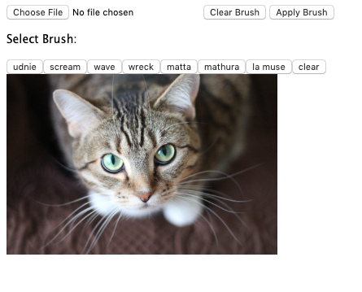

# Canvas-Style-Transfer
Brush-based interactive canvas for custom style transfer. We have two different modes of the application that can be loaded from each folder in this repository.  

## Magic Marker  
Canvas application that allows brush interactions to 'paint' on different styles. The image below shows the intial state of the application upon opening. Our default image of a cat is scaled to ensure that browser is able to handle style transformation of the entire image. All uploaded images are scaled down by a factor of 3.  

Select a brush to switch to the relevant style, and wait a few seconds for the cursor to change from an arrow to a '+' shape. This indicates that the brush is ready to be used for applying style to the image. Rectangle shaped selections can be made on the canvas, and dragged around or reshaped as needed. When happy with the painted section, click the 'Apply Brush' button to fix the changes to the image. Then, a new brush may be selected, or a new section may be painted over with the existing brush. Use the 'Clear Brush' method to remove any un-applied 'paint.' 

Below is a series of examples showing different multi-styled paintings of the cute cat image.  

### How to run
- Move into the `Magic-Marker/` directory 
- Run a local server using `python -m http.server` (if using Python 2, use the command `python -m SimpleHTTPServer` instead)
- Open http://localhost:8000 in a browser  

## Patch Patterns
Canvas application that uses real time transfer of selected sections of an image to layer on patches of style.  
### How to run
- Move into the `Patch-Patterning` directory
- Run a local server using `python -m http.server` (if using Python 2, use `python -m SimpleHTTPServer` instead)
- Open http://localhost:8000 in a browser 
